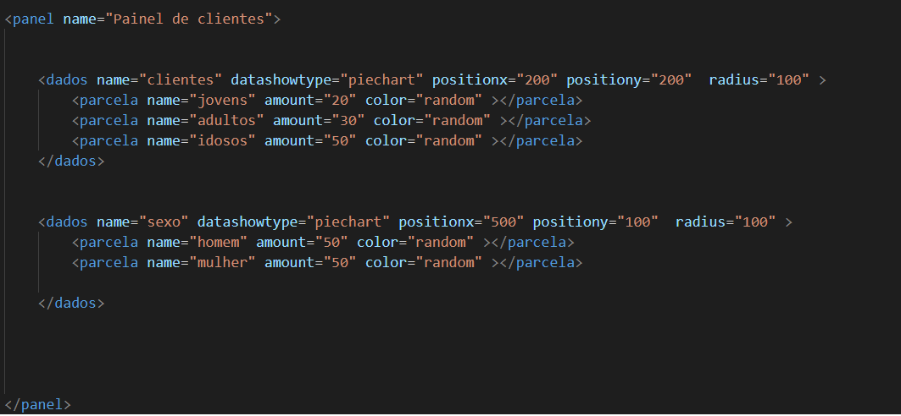
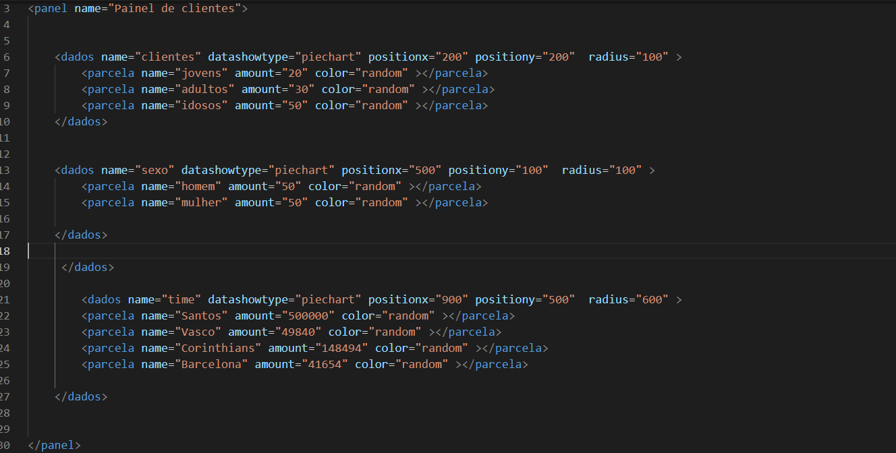
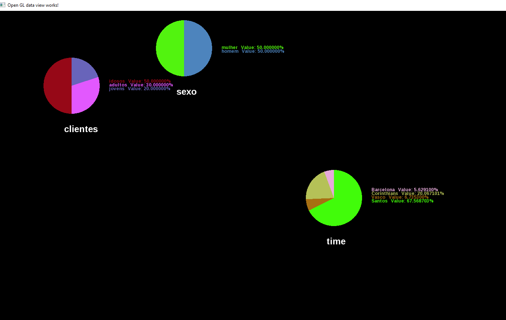

# OpenGL-data-view-
Just a proof of concept for job interview

<h1> Usage: </h1>
<h4>Edit data.xml from the same folder you are running the .exe, as shown in the image below</h4>

 
<h4>To insert new data, jus use the correc "dados" tag and specify attributes as follows:</h4>

<h2>Result from last print: </h2>

<h6>To do: allow to set the colors, insert new tools to show the data as well as better methods of reading, refactor..... etc </h6>
 
<h6>Since I coded it in just one day the code is likely very bad optimized, but as a proof of concept of technologies usage (OpenGL, C++) it's probably good to go </h6>
